# 1. Работа с HDFS и экосистемой.

### 1.1. Вывод списка директорий в `/data`.
*Список файлов в `/data`*:\
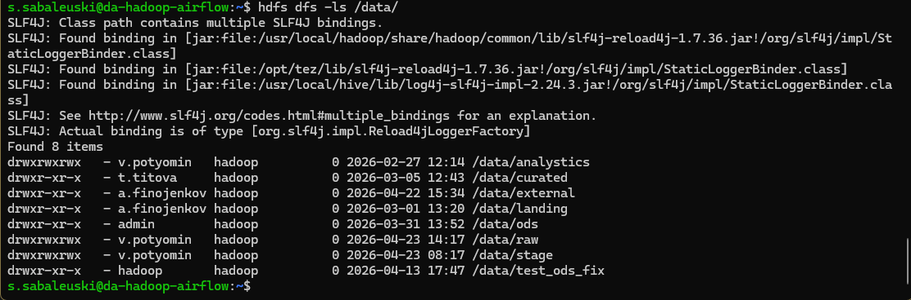

### 1.2. Вывод списка данных, хранящиеся в `/data/raw` и их аудит.
*Cписок файлов `/data/raw`*:\
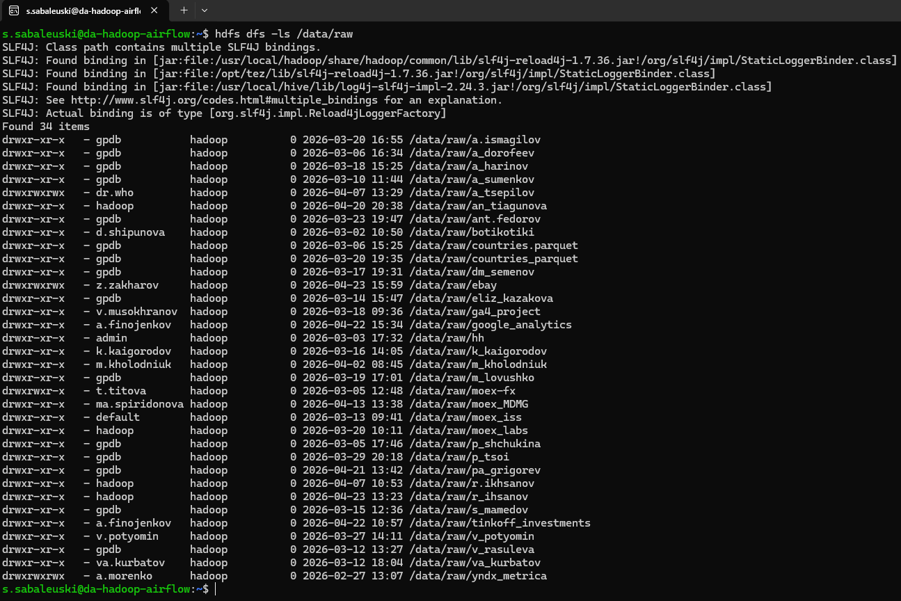

---

*Выбираем директорию `ebay` для анализа*:\
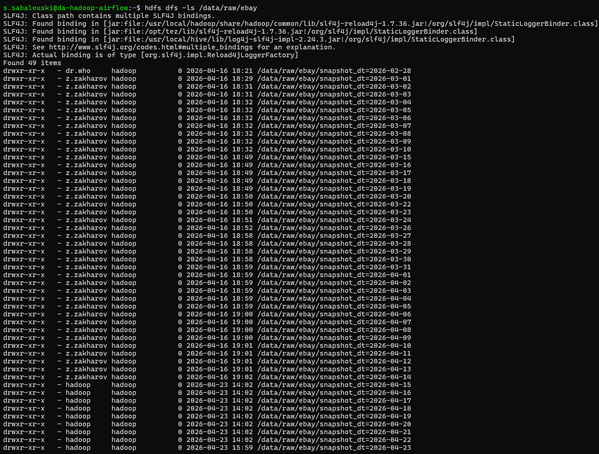
> Результат показывает директории вида `snapshot_dt=YYYY-MM-DD`, а это значит что присутствует единый шаблон.

---

*Выводим содержимое директорий `/data/raw/ebay`*:\
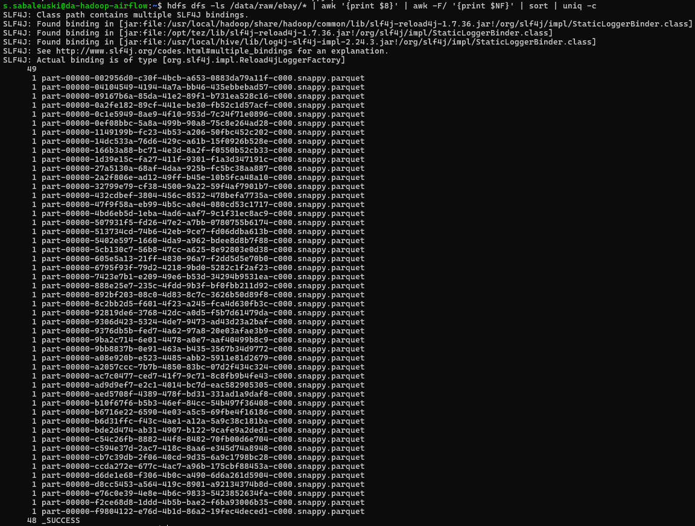
> В результате анализа файлов внутри директории /data/raw/ebay можно подвести итог:
> - все файлы имеют единый формат `.parquet`;
> - в 48 партициях присутствует служебный файл _SUCCESS (файл, подтверждающий успешную загрузку данных.). Но в одной он остутстует, что сведетельстует о незавершённой или некорректной записи файла.

### 1.3. Стоимость хранения.
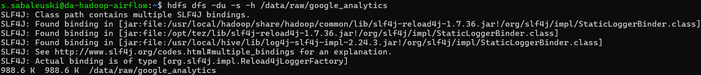
> Вывели информацию о размерах объёма с помощью `hdfs dfs -du -s -h /data/raw/google_analytics`, где:
> - `-du` команда, которая показывает объём данных;
> - `-s` суммирует размер всех файлов и выводит общий результат одной строкой;
> - `h` флаг, который выводит размер в удобочитаемом формате (KB, MB, GB).

### 1.4. Создание среды для работы.
*Проверяем в какой директории будем проводить работу:*\
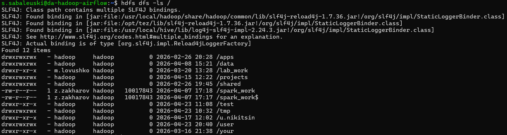
> Работу будем проводить в `/user/`

---

*Создаем свою директорию:*\
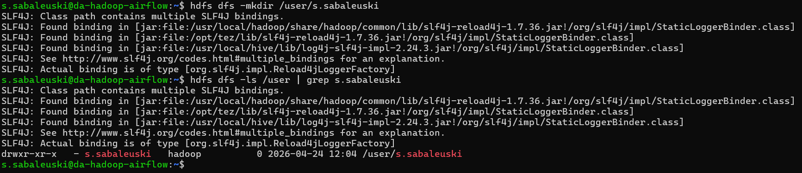
> Сразу проверили успешность создания директория.

---

*Копируем данные из `/data/raw/ebay` в свою директорию `/user/s.sabaleuski/` и сразу же проверяем успешность копирования:*\
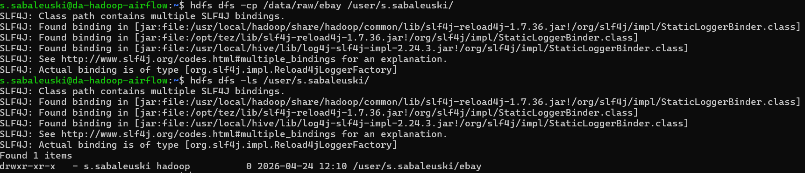

---

*Устанавливаем факт реполикации 2 для `/user/s.sabaleuski/ebay/`*\
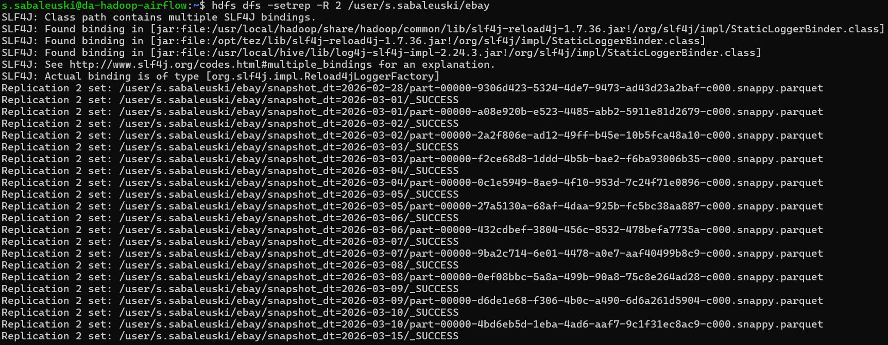
> В `hdfs dfs -setrep -R 2 /user/s.sabaleuski/ebay`:
> - `-setrep` - команда для изменения фактора репликации файлов в HDFS;
> - `R` - рекурсивно ко всем файлам и вложенным папкам.

---

*Проверяем, получилось у нас сделать факт репликации или нет:*\
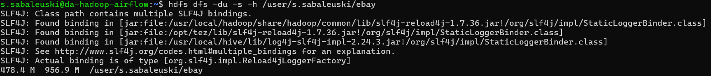
> На скриншоте видно что без факта репликации у нас размер файлов 478.4 М, а с учетом факта репликации 956.9 M.
> Это свидетельстует что операция выполнилась успешно.

### 1.5. Создание внешней (external) таблицы в Hive.
*Создаём пространство для работы в Hive:*
```sql
CREATE DATABASE IF NOT EXISTS s_sabaleuski;
```
> По неизветсным мне причинам, у меня "дропался **Hive** в **dbeaver**", работу ведём в **Hue**.

---

*Чтобы создать таблицу в **Hive**, нужно узнать структуру **.parquet**. Используем для этого развёрнутый для лаборантов **Zeppelin** и увидим с помощью **Spark** структуру "паркета":*\
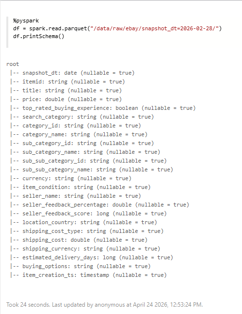

---

*Благодаря схеме из **Zeppelin** создаём таблицу в *Hive*:*
```sql
CREATE EXTERNAL TABLE IF NOT EXISTS s_sabaleuski.ebay_raw_parquet (
    snapshot_dt DATE,
    itemid STRING,
    title STRING,
    price DOUBLE,
    top_rated_buying_experience BOOLEAN,
    search_category STRING,
    category_id STRING,
    category_name STRING,
    sub_category_id STRING,
    sub_category_name STRING,
    sub_sub_category_id STRING,
    sub_sub_category_name STRING,
    currency STRING,
    item_condition STRING,
    seller_name STRING,
    seller_feedback_percentage DOUBLE,
    seller_feedback_score BIGINT,
    location_country STRING,
    shipping_cost_type STRING,
    shipping_cost DOUBLE,
    shipping_currency STRING,
    estimated_delivery_days BIGINT,
    buying_options STRING,
    item_creation_ts TIMESTAMP
)
STORED AS PARQUET 
LOCATION '/user/s.sabaleuski/ebay';
```

---

*Таблица создана:*\
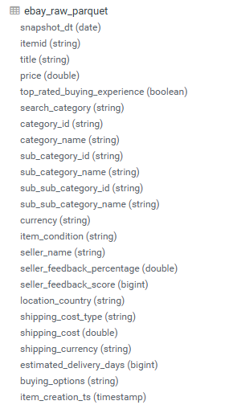

### 1.6. Создание целевой таблицы с настройкой партиционирования по дате выгрузки.
```sql
CREATE TABLE IF NOT EXISTS s_sabaleuski.ebay_listings_optimized (
    itemid STRING,
    title STRING,
    price DOUBLE,
    top_rated_buying_experience BOOLEAN,
    search_category STRING,
    category_id STRING,
    category_name STRING,
    sub_category_id STRING,
    sub_category_name STRING,
    sub_sub_category_id STRING,
    sub_sub_category_name STRING,
    currency STRING,
    item_condition STRING,
    seller_name STRING,
    seller_feedback_percentage DOUBLE,
    seller_feedback_score BIGINT,
    location_country STRING,
    shipping_cost_type STRING,
    shipping_cost DOUBLE,
    shipping_currency STRING,
    estimated_delivery_days BIGINT,
    buying_options STRING,
    item_creation_ts TIMESTAMP
)
PARTITIONED BY (snapshot_dt DATE)
STORED AS PARQUET;
```

*Проверим что получилось:*\
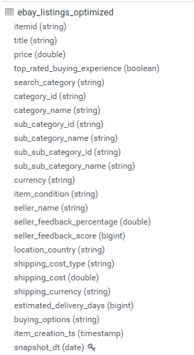

### 1.7. Перенос данных (ETL Process).
*Включаем динамические партиции:*
```sql
SET hive.exec.dynamic.partition = true;
SET hive.exec.dynamic.partition.mode = nonstrict;
```
> `hive.exec.dynamic.partition = true` - разрешает создавать партиции автоматически;
> `hive.exec.dynamic.partition.mode = nonstrict` - разрешает все партиции создавать динамически.

---

*Переносим данные:*
```sql
INSERT INTO s_sabaleuski.ebay_listings_optimized
PARTITION (snapshot_dt)
SELECT itemid,
       title,
       price,
       top_rated_buying_experience,
       search_category,
       category_id,
       category_name,
       sub_category_id,
       sub_category_name,
       sub_sub_category_id,
       sub_sub_category_name,
       currency,
       item_condition,
       seller_name,
       seller_feedback_percentage,
       seller_feedback_score,
       location_country,
       shipping_cost_type,
       shipping_cost,
       shipping_currency,
       estimated_delivery_days,
       buying_options,
       item_creation_ts,
       snapshot_dt
FROM s_sabaleuski.ebay_raw_parquet;
```

*Проверям партиции:*\
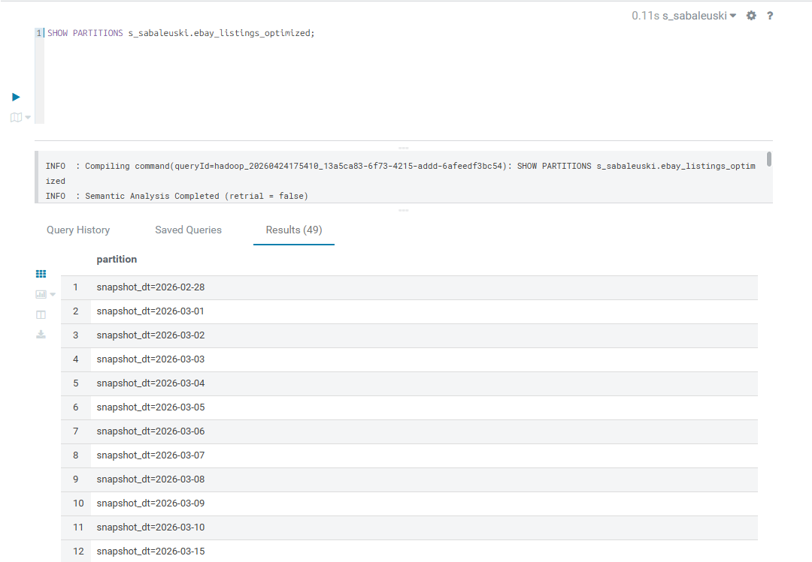

*Проверям данные:*\
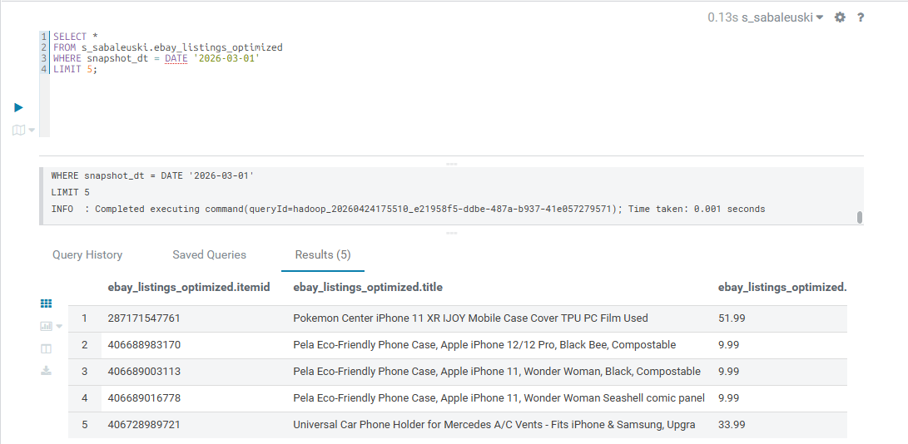

### 1.8. Переход от одной большой витрины к Снежинке (eBay).
Чтобы потроить снежинку, нужно разобраться какие данные к чему подходят.
> itemid - id товара (dim_item);\
> title - описание товара (dim_item);\
> price - цена товара (fact);\
> top_rated_buying_experience - флаг качества продавца (fact);\
> search_category - что это: категория, по которой искали товар (fact);\
> category_id / category_name - id и имя категории (dim_category);\
> sub_category_id / sub_category_name - подкатегории (dim_sub_category);\
> sub_sub_category_id / sub_sub_category_name - подподкатегории :) (dim_sub_sub_category);\
> currency - валюта цены (dim_currencies, fact);\
> item_condition - состояние товара б/у или нет (dim_conditions, fact);\
> seller_name - имя продавца (dim_sellers, fact);\
> seller_feedback_percentage - фидбек продавца (dim_sellers);\
> seller_feedback_score - количество фидбеков продавца (dim_sellers);\
> location_country - локация продавца (dim_locations, fact);\
> shipping_cost_type - тип доставки (бесплатная или оплачена) (dim_logistics + fact);\
> shipping_cost - стоимость доставки (fact);\
> shipping_currency - валюта доставки (dim_logistics, fact);\
> estimated_delivery_days - срок доставки (dim_logistics);\
> buying_options - способ покупки (fact);\
> item_creation_ts - время создания товара (dim_items);\
> snapshot_dt - дата выгрузки данных, будем использовать как партицию.

Теперь подведём итог по полям:\
| Таблица                    | Поля |
|---------------------------|------|
| fact_ebay_listings        | itemid, seller_name, location_country, item_condition, currency, shipping_cost_type, shipping_currency, price, shipping_cost, top_rated_buying_experience, search_category, buying_options, snapshot_dt |
| dim_items                 | itemid, title, item_creation_ts, sub_sub_category_id, snapshot_dt |
| dim_sellers               | seller_name, seller_feedback_percentage, seller_feedback_score, snapshot_dt |
| dim_locations             | location_country, snapshot_dt |
| dim_conditions            | item_condition, snapshot_dt |
| dim_currencies            | currency, snapshot_dt |
| dim_logistics             | shipping_cost_type, shipping_currency, estimated_delivery_days, snapshot_dt |
| dim_cat                   | category_id, category_name, snapshot_dt |
| dim_sub_cat               | sub_category_id, sub_category_name, category_id, snapshot_dt |
| dim_sub_sub_cat           | sub_sub_category_id, sub_sub_category_name, sub_category_id, snapshot_dt |


```mermaid
erDiagram
    FACT_EBAY_LISTINGS {
        string itemid
        string seller_name
        string location_country
        string item_condition
        string currency
        string shipping_cost_type
        string shipping_currency
        double price
        double shipping_cost
        boolean top_rated_buying_experience
        string search_category
        string buying_options
        date snapshot_dt
    }

    DIM_ITEMS {
        string itemid
        string title
        timestamp item_creation_ts
        string sub_sub_category_id
        date snapshot_dt
    }

    DIM_SELLERS {
        string seller_name
        double seller_feedback_percentage
        bigint seller_feedback_score
        date snapshot_dt
    }

    DIM_LOCATIONS {
        string location_country
        date snapshot_dt
    }

    DIM_CONDITIONS {
        string item_condition
        date snapshot_dt
    }

    DIM_CURRENCIES {
        string currency
        date snapshot_dt
    }

    DIM_LOGISTICS {
        string shipping_cost_type
        string shipping_currency
        bigint estimated_delivery_days
        date snapshot_dt
    }

    DIM_CAT {
        string category_id
        string category_name
        date snapshot_dt
    }

    DIM_SUB_CAT {
        string sub_category_id
        string sub_category_name
        string category_id
        date snapshot_dt
    }

    DIM_SUB_SUB_CAT {
        string sub_sub_category_id
        string sub_sub_category_name
        string sub_category_id
        date snapshot_dt
    }

    FACT_EBAY_LISTINGS }o--|| DIM_ITEMS : itemid
    FACT_EBAY_LISTINGS }o--|| DIM_SELLERS : seller_name
    FACT_EBAY_LISTINGS }o--|| DIM_LOCATIONS : location_country
    FACT_EBAY_LISTINGS }o--|| DIM_CONDITIONS : item_condition
    FACT_EBAY_LISTINGS }o--|| DIM_CURRENCIES : currency
    FACT_EBAY_LISTINGS }o--|| DIM_LOGISTICS : shipping_cost_type_shipping_currency

    DIM_ITEMS }o--|| DIM_SUB_SUB_CAT : sub_sub_category_id
    DIM_SUB_SUB_CAT }o--|| DIM_SUB_CAT : sub_category_id
    DIM_SUB_CAT }o--|| DIM_CAT : category_id
