# 1. Работа с HDFS и экосистемой.

### 1.1. Вывод списка директорий в `/data`.
*Список файлов в `/data`*:\


### 1.2. Вывод списка данных, хранящиеся в `/data/raw` и их аудит.
*Cписок файлов `/data/raw`*:\


---

*Выбираем директорию `ebay` для анализа*:\

> Результат показывает директории вида `snapshot_dt=YYYY-MM-DD`, а это значит что присутствует единый шаблон.

---

*Выводим содержимое директорий `/data/raw/ebay`*:\

> В результате анализа файлов внутри директории /data/raw/ebay можно подвести итог:
> - все файлы имеют единый формат `.parquet`;
> - в 48 партициях присутствует служебный файл _SUCCESS (файл, подтверждающий успешную загрузку данных.). Но в одной он остутстует, что сведетельстует о незавершённой или некорректной записи файла.

### 1.3. Стоимость хранения.

> Вывели информацию о размерах объёма с помощью `hdfs dfs -du -s -h /data/raw/google_analytics`, где:
> - `-du` команда, которая показывает объём данных;
> - `-s` суммирует размер всех файлов и выводит общий результат одной строкой;
> - `h` флаг, который выводит размер в удобочитаемом формате (KB, MB, GB).

### 1.4. Создание среды для работы.
*Проверяем в какой директории будем проводить работу:*\

> Работу будем проводить в `/user/`

---

*Создаем свою директорию:*\

> Сразу проверили успешность создания директория.

---

*Копируем данные из `/data/raw/ebay` в свою директорию `/user/s.sabaleuski/` и сразу же проверяем успешность копирования:*\


---

*Устанавливаем факт реполикации 2 для `/user/s.sabaleuski/ebay/`*\

> В `hdfs dfs -setrep -R 2 /user/s.sabaleuski/ebay`:
> - `-setrep` - команда для изменения фактора репликации файлов в HDFS;
> - `R` - рекурсивно ко всем файлам и вложенным папкам.

---

*Проверяем, получилось у нас сделать факт репликации или нет:*\

> На скриншоте видно что без факта репликации у нас размер файлов 478.4 М, а с учетом факта репликации 956.9 M.
> Это свидетельстует что операция выполнилась успешно.

### 1.5. Создание внешней (external) таблицы в Hive.
*Создаём пространство для работы в Hive:*
```sql
CREATE DATABASE IF NOT EXISTS s_sabaleuski;
```
> По неизветсным мне причинам, у меня "дропался **Hive** в **dbeaver**", работу ведём в **Hue**.

---

*Чтобы создать таблицу в **Hive**, нужно узнать структуру **.parquet**. Используем для этого развёрнутый для лаборантов **Zeppelin** и увидим с помощью **Spark** структуру "паркета":*\


---

*Благодаря схеме из **Zeppelin** создаём таблицу в *Hive*:*
```sql
CREATE EXTERNAL TABLE IF NOT EXISTS s_sabaleuski.ebay_raw_parquet (
    snapshot_dt DATE,
    itemid STRING,
    title STRING,
    price DOUBLE,
    top_rated_buying_experience BOOLEAN,
    search_category STRING,
    category_id STRING,
    category_name STRING,
    sub_category_id STRING,
    sub_category_name STRING,
    sub_sub_category_id STRING,
    sub_sub_category_name STRING,
    currency STRING,
    item_condition STRING,
    seller_name STRING,
    seller_feedback_percentage DOUBLE,
    seller_feedback_score BIGINT,
    location_country STRING,
    shipping_cost_type STRING,
    shipping_cost DOUBLE,
    shipping_currency STRING,
    estimated_delivery_days BIGINT,
    buying_options STRING,
    item_creation_ts TIMESTAMP
)
STORED AS PARQUET 
LOCATION '/user/s.sabaleuski/ebay';
```

---

*Таблица создана:*\


### 1.6. Создание целевой таблицы с настройкой партиционирования по дате выгрузки.
```sql
CREATE TABLE IF NOT EXISTS s_sabaleuski.ebay_listings_optimized (
    itemid STRING,
    title STRING,
    price DOUBLE,
    top_rated_buying_experience BOOLEAN,
    search_category STRING,
    category_id STRING,
    category_name STRING,
    sub_category_id STRING,
    sub_category_name STRING,
    sub_sub_category_id STRING,
    sub_sub_category_name STRING,
    currency STRING,
    item_condition STRING,
    seller_name STRING,
    seller_feedback_percentage DOUBLE,
    seller_feedback_score BIGINT,
    location_country STRING,
    shipping_cost_type STRING,
    shipping_cost DOUBLE,
    shipping_currency STRING,
    estimated_delivery_days BIGINT,
    buying_options STRING,
    item_creation_ts TIMESTAMP
)
PARTITIONED BY (snapshot_dt DATE)
STORED AS PARQUET;
```

---

*Проверим что получилось:*\


### 1.7. Перенос данных (ETL Process).
*Включаем динамические партиции:*
```sql
SET hive.exec.dynamic.partition = true;
SET hive.exec.dynamic.partition.mode = nonstrict;
```
> `hive.exec.dynamic.partition = true` - разрешает создавать партиции автоматически;
> `hive.exec.dynamic.partition.mode = nonstrict` - разрешает все партиции создавать динамически.

---

*Переносим данные:*
```sql
INSERT INTO s_sabaleuski.ebay_listings_optimized
PARTITION (snapshot_dt)
SELECT itemid,
       title,
       price,
       top_rated_buying_experience,
       search_category,
       category_id,
       category_name,
       sub_category_id,
       sub_category_name,
       sub_sub_category_id,
       sub_sub_category_name,
       currency,
       item_condition,
       seller_name,
       seller_feedback_percentage,
       seller_feedback_score,
       location_country,
       shipping_cost_type,
       shipping_cost,
       shipping_currency,
       estimated_delivery_days,
       buying_options,
       item_creation_ts,
       snapshot_dt
FROM s_sabaleuski.ebay_raw_parquet;
```

---

*Проверям партиции:*\


---

*Проверям данные:*\


### 1.8.1. Переход от одной большой витрины к Снежинке (eBay) [Часть DDL].
*Чтобы потроить снежинку, нужно разобраться какие данные к чему подходят:*
> `itemid` - id товара (dim_item);\
> `title` - описание товара (dim_item);\
> `price` - цена товара (fact);\
> `top_rated_buying_experience` - флаг качества покупательского опыта по конкретному листингу (fact);\
> `search_category` - что это: категория, по которой искали товар (fact);\
> `category_id / category_name` - id и имя категории (dim_category);\
> `sub_category_id / sub_category_name` - подкатегории (dim_sub_category);\
> `sub_sub_category_id / sub_sub_category_name` - подподкатегории :) (dim_sub_sub_category);\
> `currency` - валюта цены (dim_currencies, fact);\
> `item_condition` - состояние товара б/у или нет (dim_conditions, fact);\
> `seller_name` - имя продавца (dim_sellers, fact);\
> `seller_feedback_percentage` - фидбек продавца (dim_sellers);\
> `seller_feedback_score` - количество фидбеков продавца (dim_sellers);\
> `location_country` - локация продавца (dim_locations, fact);\
> `shipping_cost_type` - тип доставки (бесплатная или оплачена) (dim_logistics + fact);\
> `shipping_cost` - стоимость доставки (fact);\
> `shipping_currency` - валюта доставки (dim_logistics, fact);\
> `estimated_delivery_days` - срок доставки (dim_logistics);\
> `buying_options` - способ покупки (fact);\
> `item_creation_ts` - время создания товара (dim_items);\
> `snapshot_dt` - дата выгрузки данных, будем использовать как партицию.

---

*Теперь подведём итог по полям:* \
| Таблица                    | Поля |
|---------------------------|------|
| fact_ebay_listings        | itemid, seller_name, location_country, item_condition, currency, shipping_cost_type, shipping_currency, price, shipping_cost, top_rated_buying_experience, search_category, buying_options, snapshot_dt |
| dim_items                 | itemid, title, item_creation_ts, sub_sub_category_id, snapshot_dt |
| dim_sellers               | seller_name, seller_feedback_percentage, seller_feedback_score, snapshot_dt |
| dim_locations             | location_country, snapshot_dt |
| dim_conditions            | item_condition, snapshot_dt |
| dim_currencies            | currency, snapshot_dt |
| dim_logistics             | shipping_cost_type, shipping_currency, estimated_delivery_days, snapshot_dt |
| dim_cat                   | category_id, category_name, snapshot_dt |
| dim_sub_cat               | sub_category_id, sub_category_name, category_id, snapshot_dt |
| dim_sub_sub_cat           | sub_sub_category_id, sub_sub_category_name, sub_category_id, snapshot_dt |

---

*Составим ER-диаграмму, и посмотрим как будем создавать снежинку:* \
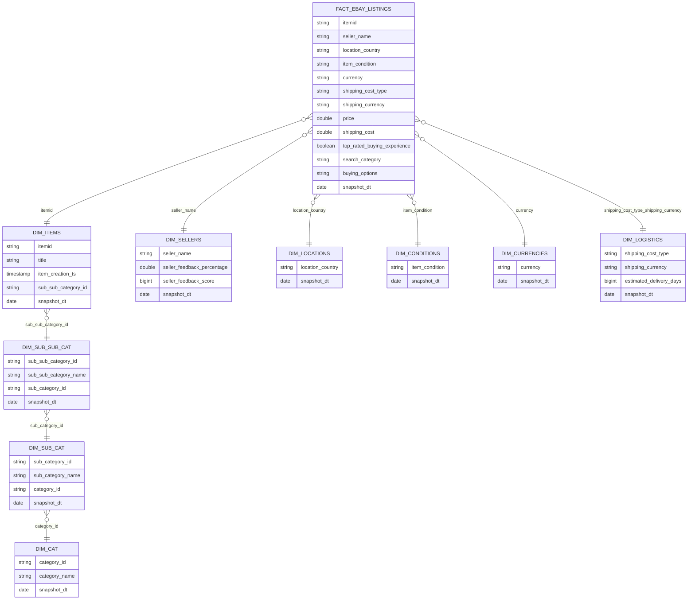

---

*Теперь перейдём к DDL. Как требовалось в задании, создаём таблицы с партициями:* \
```sql
-- ============ Иерархия категорий ============
CREATE TABLE IF NOT EXISTS s_sabaleuski.dim_cat (
    category_id STRING,
    category_name STRING
)
PARTITIONED BY (snapshot_dt DATE)
STORED AS PARQUET;

CREATE TABLE IF NOT EXISTS s_sabaleuski.dim_sub_cat (
    sub_category_id STRING,
    sub_category_name STRING,
    category_id STRING
)
PARTITIONED BY (snapshot_dt DATE)
STORED AS PARQUET;

CREATE TABLE IF NOT EXISTS s_sabaleuski.dim_sub_sub_cat (
    sub_sub_category_id STRING,
    sub_sub_category_name STRING,
    sub_category_id STRING
)
PARTITIONED BY (snapshot_dt DATE)
STORED AS PARQUET;


-- ============ Измерения ============
CREATE TABLE IF NOT EXISTS s_sabaleuski.dim_items (
    itemid STRING,
    title STRING,
    sub_sub_category_id STRING,
    item_creation_ts TIMESTAMP
)
PARTITIONED BY (snapshot_dt DATE)
STORED AS PARQUET;

CREATE TABLE IF NOT EXISTS s_sabaleuski.dim_sellers (
    seller_name STRING,
    seller_feedback_percentage DOUBLE,
    seller_feedback_score BIGINT
)
PARTITIONED BY (snapshot_dt DATE)
STORED AS PARQUET;

CREATE TABLE IF NOT EXISTS s_sabaleuski.dim_locations (
    location_country STRING
)
PARTITIONED BY (snapshot_dt DATE)
STORED AS PARQUET;

CREATE TABLE IF NOT EXISTS s_sabaleuski.dim_conditions (
    item_condition STRING
)
PARTITIONED BY (snapshot_dt DATE)
STORED AS PARQUET;

CREATE TABLE IF NOT EXISTS s_sabaleuski.dim_currencies (
    currency STRING
)
PARTITIONED BY (snapshot_dt DATE)
STORED AS PARQUET;

CREATE TABLE IF NOT EXISTS s_sabaleuski.dim_logistics (
    shipping_cost_type STRING,
    shipping_currency STRING,
    estimated_delivery_days BIGINT
)
PARTITIONED BY (snapshot_dt DATE)
STORED AS PARQUET;


-- ============ Таблица фактов ============
CREATE TABLE IF NOT EXISTS s_sabaleuski.fact_ebay_listings (
    itemid STRING,
    seller_name STRING,
    location_country STRING,
    item_condition STRING,
    currency STRING,
    shipping_cost_type STRING,
    shipping_currency STRING,
    price DOUBLE,
    shipping_cost DOUBLE,
    top_rated_buying_experience BOOLEAN,
    search_category STRING,
    buying_options STRING
)
PARTITIONED BY (snapshot_dt DATE)
STORED AS PARQUET;
```

---

*Проверим создались ли таблицы:* \
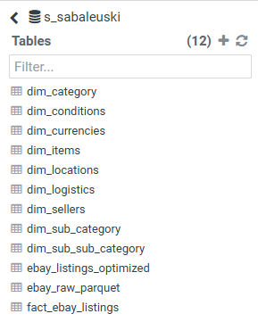

---

*Проверим структуру fact-таблицы:* \
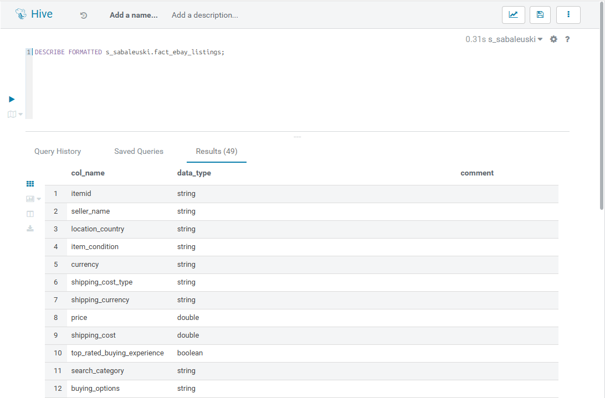

---

*И также проверим структуру любой таблицы-измерений:* \
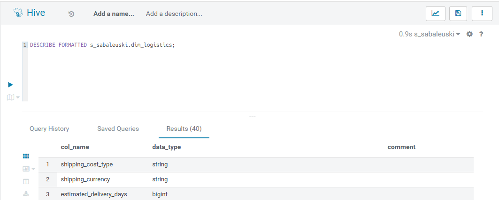

### 1.8.2. Заполнение снежинки данными [DML часть].
*Подюключаемся к нашей таблице и проверяем данные:* \
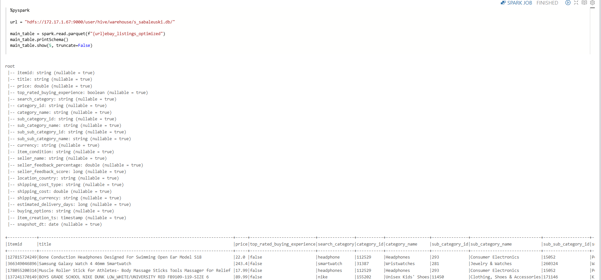

---

*Насыщаем данными таблицы-иерархии:* \
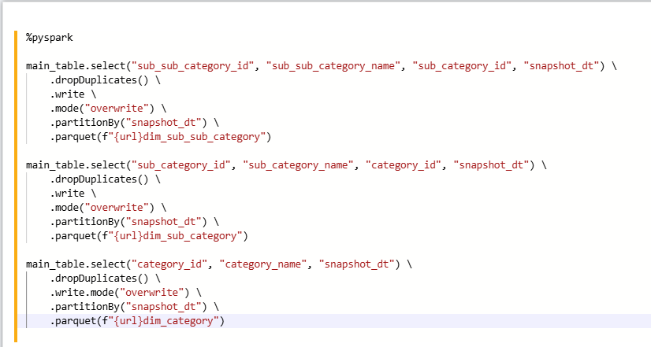

---

*Насыщаем данными таблиц-измерений:* \
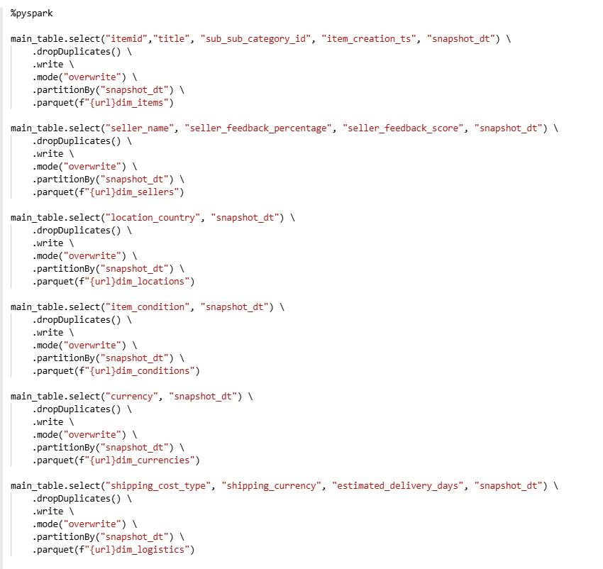

---

*Насыщаем данными таблицу-фактов:* \
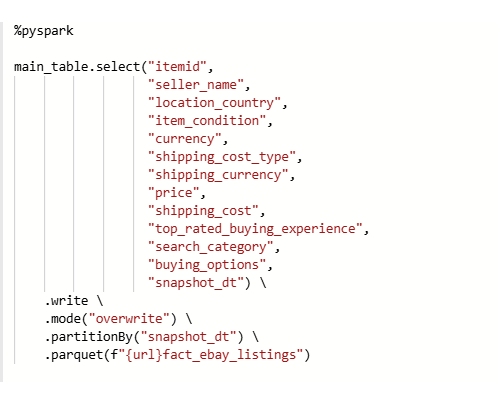

---

*Проверяем что данные загрузились:* \
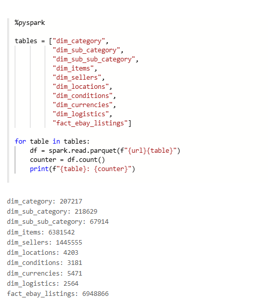

### 1.9. Выполнение заданий с помощью Spark API и Spark SQL.
*Подготавливаем таблицы и библиотеки, которые пригодятся для задания:* \
```python
%pyspark

from pyspark.sql import functions as F
from pyspark.sql.window import Window

spark.read.parquet(f"{url}fact_ebay_listings").createOrReplaceTempView("fact")
spark.read.parquet(f"{url}dim_items").createOrReplaceTempView("items")
spark.read.parquet(f"{url}dim_category").createOrReplaceTempView("cat")
spark.read.parquet(f"{url}dim_sub_category").createOrReplaceTempView("sub_cat")
spark.read.parquet(f"{url}dim_sub_sub_category").createOrReplaceTempView("sub_sub_cat")
spark.read.parquet(f"{url}dim_sellers").createOrReplaceTempView("sellers")
spark.read.parquet(f"{url}dim_logistics").createOrReplaceTempView("logistics")
spark.read.parquet(f"{url}ebay_listings_optimized").createOrReplaceTempView("ebay_listings_optimized")

fact_df = spark.read.parquet(f"{url}fact_ebay_listings")
items_df = spark.read.parquet(f"{url}dim_items")
cat_df = spark.read.parquet(f"{url}dim_category")
sub_cat_df = spark.read.parquet(f"{url}dim_sub_category")
sub_sub_cat_df = spark.read.parquet(f"{url}dim_sub_sub_category")
sellers_df = spark.read.parquet(f"{url}dim_sellers")
logistics_df = spark.read.parquet(f"{url}dim_logistics")
ebay_listings_optimized_df = spark.read.parquet(f"{url}ebay_listings_optimized")
```

##### 1.9.1. Рассчитать количество товаров, среднюю цену и максимальную цену для каждой category_name.
```python
%pyspark

print("======== Решение с помощью Spark SQL ========")
spark.sql("""
SELECT c.category_name,
       COUNT(i.itemid) AS count_items,
       AVG(f.price) AS avg_price,
       MAX(f.price) AS max_price
FROM fact f
JOIN items i
  ON f.itemid = i.itemid
 AND f.snapshot_dt = DATE '2026-03-01'
 AND i.snapshot_dt = DATE '2026-03-01'
JOIN sub_sub_cat ssc
  ON i.sub_sub_category_id = ssc.sub_sub_category_id
 AND i.snapshot_dt = ssc.snapshot_dt
JOIN sub_cat sc
  ON ssc.sub_category_id = sc.sub_category_id
 AND ssc.snapshot_dt = sc.snapshot_dt
JOIN cat c
  ON sc.category_id = c.category_id
 AND sc.snapshot_dt = c.snapshot_dt
GROUP BY c.category_name
ORDER BY count_items DESC
LIMIT 20
""").show()

print("======== Решение с помощью Spark API ========")
result_df1 = fact_df.alias("f") \
    .join(items_df.alias("i"),
          (F.col("f.itemid") == F.col("i.itemid")) &
          (F.col("f.snapshot_dt") == F.lit("2026-03-01")) &
          (F.col("i.snapshot_dt") == F.lit("2026-03-01"))) \
    .join(sub_sub_cat_df.alias("ssc"),
          (F.col("i.sub_sub_category_id") == F.col("ssc.sub_sub_category_id")) &
          (F.col("i.snapshot_dt") == F.col("ssc.snapshot_dt"))) \
    .join(sub_cat_df.alias("sc"),
          (F.col("ssc.sub_category_id") == F.col("sc.sub_category_id")) &
          (F.col("ssc.snapshot_dt") == F.col("sc.snapshot_dt"))) \
    .join(cat_df.alias("c"),
          (F.col("sc.category_id") == F.col("c.category_id")) &
          (F.col("sc.snapshot_dt") == F.col("c.snapshot_dt"))) \
    .filter(F.col("f.snapshot_dt") == F.lit("2026-03-01")) \
    .groupBy(F.col("c.category_name")) \
    .agg(F.count(F.col("i.itemid")).alias("count_items"),
         F.avg(F.col("f.price")).alias("avg_price"),
         F.max(F.col("f.price")).alias("max_price")) \
    .orderBy(F.desc("count_items")) \
    .limit(20).show()
```
> Использовали партицию даты, чтобы ускорить запрос и узнать результат по конкретной дате.

---

*Результат:* \
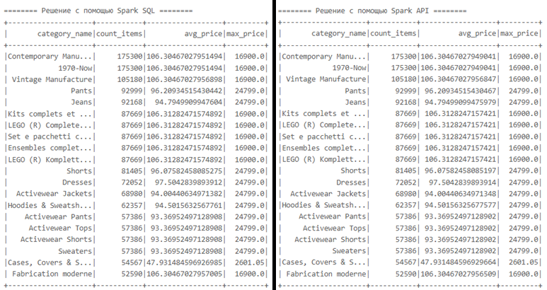

##### 1.9.2. Выявить связь между статусом продавца и условиями доставки. Вывести топ-10 стран (location_country), в которых средний процент положительных отзывов (seller_feedback_percentage) у «топ-продавцов» (top_rated_buying_experience = true) выше всего.
```python
%pyspark

print("======== Решение с помощью Spark SQL ========")
spark.sql("""
SELECT f.location_country,
       AVG(s.seller_feedback_percentage) AS avg_feedback_percentage
FROM fact f
JOIN sellers s ON f.seller_name = s.seller_name AND f.snapshot_dt = s.snapshot_dt
WHERE f.top_rated_buying_experience = true
GROUP BY f.location_country
ORDER BY avg_feedback_percentage DESC
LIMIT 20
""").show()

print("======== Решение с помощью Spark API ========")
result_df2 = fact_df.alias("f") \
    .join(sellers_df.alias("s"),
          (F.col("f.seller_name") == F.col("s.seller_name")) &
          (F.col("f.snapshot_dt") == F.col("s.snapshot_dt"))) \
    .filter(F.col("f.top_rated_buying_experience") == True) \
    .groupBy(F.col("f.location_country")) \
    .agg(F.avg(F.col("s.seller_feedback_percentage")).alias("avg_feedback_percentage")) \
    .orderBy(F.desc("avg_feedback_percentage")) \
    .limit(20).show()
```

---

*Результат:* \
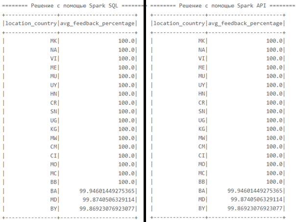

##### 1.9.3. Создать новый столбец total_price_usd, который суммирует price и shipping_cost. Вывести список товаров, где эта сумма превышает 500 USD, а доставка является фиксированной (shipping_cost_type = 'FIXED').
```python
%pyspark

print("======== Решение с помощью Spark SQL ========")
spark.sql("""
SELECT itemid,
       seller_name,
       location_country,
       price,
       shipping_cost,
       price + shipping_cost AS total_price_usd
FROM fact
WHERE shipping_cost_type = 'FIXED' AND (price + shipping_cost) > 500
ORDER BY total_price_usd DESC
LIMIT 20
""").show()

print("======== Решение с помощью Spark API ========")
result_df3 = fact_df \
    .filter(F.col("shipping_cost_type") == "FIXED") \
    .withColumn("total_price_usd", F.col("price") + F.col("shipping_cost")) \
    .filter(F.col("total_price_usd") > 500) \
    .select("itemid", "seller_name", "location_country", "price", "shipping_cost", "total_price_usd") \
    .orderBy(F.desc("total_price_usd")) \
    .limit(20).show()
```

---

*Результат:* \
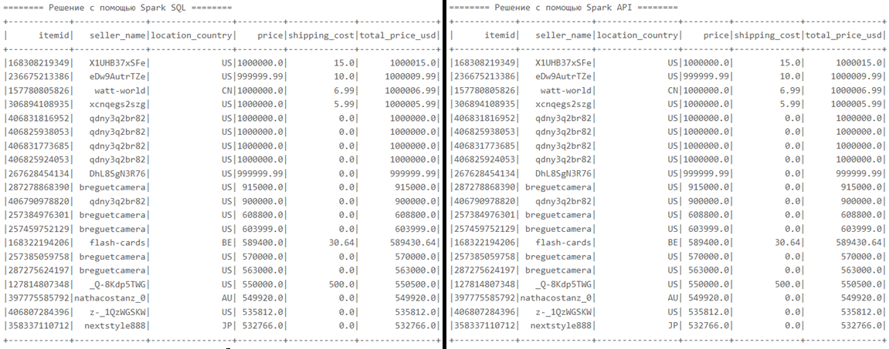

##### 1.9.4. В каждой подкатегории (sub_category_name) найти по одному продавцу с самым высоким показателем seller_feedback_score.
```python
%pyspark

print("======== Решение с помощью Spark SQL ========")
spark.sql(f"""
WITH seller_sub_category AS (
    SELECT DISTINCT sc.sub_category_name,
                    s.seller_name,
                    s.seller_feedback_score
    FROM fact f
    JOIN items i
      ON f.itemid = i.itemid
     AND f.snapshot_dt = DATE '2026-03-01'
     AND i.snapshot_dt = DATE '2026-03-01'
    JOIN sub_sub_cat ssc
      ON i.sub_sub_category_id = ssc.sub_sub_category_id
     AND i.snapshot_dt = ssc.snapshot_dt
    JOIN sub_cat sc
      ON ssc.sub_category_id = sc.sub_category_id
     AND ssc.snapshot_dt = sc.snapshot_dt
    JOIN sellers s
      ON f.seller_name = s.seller_name
     AND f.snapshot_dt = s.snapshot_dt
),
ranked AS (
    SELECT sub_category_name,
           seller_name,
           seller_feedback_score,
           ROW_NUMBER() OVER (PARTITION BY sub_category_name ORDER BY seller_feedback_score DESC) AS rn
    FROM seller_sub_category
)
SELECT sub_category_name,
       seller_name,
       seller_feedback_score
FROM ranked
WHERE rn = 1
ORDER BY sub_category_name
LIMIT 20
""").show()


print("======== Решение с помощью Spark API ========")
seller_sub_category_df = fact_df.alias("f") \
    .filter(F.col("f.snapshot_dt") == F.lit("2026-03-01")) \
    .join(items_df.alias("i"), (F.col("f.itemid") == F.col("i.itemid")) & (F.col("f.snapshot_dt") == F.col("i.snapshot_dt")), "inner") \
    .join(sub_sub_cat_df.alias("ssc"), (F.col("i.sub_sub_category_id") == F.col("ssc.sub_sub_category_id")) & (F.col("i.snapshot_dt") == F.col("ssc.snapshot_dt")), "inner") \
    .join(sub_cat_df.alias("sc"), (F.col("ssc.sub_category_id") == F.col("sc.sub_category_id")) & (F.col("ssc.snapshot_dt") == F.col("sc.snapshot_dt")), "inner") \
    .join(sellers_df.alias("s"), (F.col("f.seller_name") == F.col("s.seller_name")) & (F.col("f.snapshot_dt") == F.col("s.snapshot_dt")), "inner") \
    .select(F.col("sc.sub_category_name"), F.col("s.seller_name"), F.col("s.seller_feedback_score")) \
    .distinct()

w = Window.partitionBy("sub_category_name") \
    .orderBy(F.desc("seller_feedback_score"))

result_df4 = seller_sub_category_df \
    .withColumn("rn", F.row_number().over(w)) \
    .filter(F.col("rn") == 1) \
    .select("sub_category_name", "seller_name", "seller_feedback_score") \
    .orderBy("sub_category_name") \
    .limit(20).show()
```

---

*Результат:* \
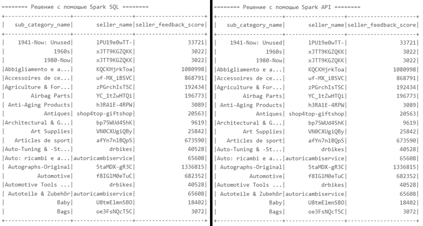

##### 1.9.5. Посчитать количество пропущенных значений (NULL) в колонке estimated_delivery_days для каждой даты выгрузки (snapshot_dt). Вывести только те даты, где количество пропусков больше 10% от общего числа записей за этот день.
```python
%pyspark

print("======== Решение с помощью Spark SQL ========")
spark.sql("""
WITH t1 AS (
    SELECT
        snapshot_dt,
        COUNT(*) AS total_rows,
        SUM(CASE WHEN estimated_delivery_days IS NULL THEN 1 ELSE 0 END) AS null_counter
    FROM ebay_listings_optimized
    GROUP BY snapshot_dt
)
SELECT snapshot_dt,
       total_rows,
       null_counter,
       ROUND(100.0 * null_counter / total_rows, 2) AS part_of_nulls
FROM t1
WHERE 100.0 * null_counter / total_rows > 10
ORDER BY part_of_nulls DESC
LIMIT 10
""").show()

print("======== Решение с помощью Spark API ========")
result_df5 = ebay_listings_optimized_df \
    .groupBy("snapshot_dt") \
    .agg(F.count("*").alias("total_rows"), F.sum(F.when(F.col("estimated_delivery_days").isNull(), 1).otherwise(0)).alias("null_counter")) \
    .withColumn("part_of_nulls", F.round(100.0 * F.col("null_counter") / F.col("total_rows"), 2)) \
    .filter((100.0 * F.col("null_counter") / F.col("total_rows")) > 10) \
    .orderBy(F.desc("part_of_nulls")) \
    .limit(10).show()
```

---

*Результат:* \
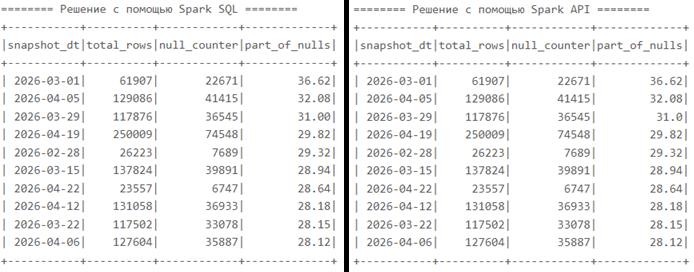

##### 1.9.6. Для каждого сложного расчета (проценты, total_price_usd, доля NULL > 10%) описать: что именно считается, почему формула корректна, как можно проверить, что нет логических ошибок (например, тестовый выборочный запрос по одному продавцу/дате).
1. `total_price_usd = price + shipping_cost` - рассчитывается как сумма цены товара и стоимости доставки, что отражает полную сумму, которую платит покупатель. Формула корректна, так как обе величины аддитивны и находятся в одной валюте.
2. `AVG(seller_feedback_percentage)` - рассчитывает средний процент положительных отзывов продавцов в группе. Формула корректна, так как показатель уже нормирован в диапазоне 0–100 и среднее значение отражает общий уровень качества продавцов.
3. `доля NULL > 10%` - рассчитывается как отношение количества пропущенных значений к общему числу записей. Условие >10% позволяет выявить даты с низким качеством данных.

##### 1.9.7. Описать текстом/схемой реализованный ETL-процесс: все использованные инструменты, фильтры, очистки. дедубликации и т.д.
1. Сначала я изучил данные, которые нужны для работы. Проверил с помощью Zeppelin + Spark схему файла `parquet`. И на основании этих данных я создал внешную таблицу для дальшейней работы.
2. Для сырого слоя данных я использовал таблицу `ebay_listings_optimized`, создал схему из внешней таблицы + использовал технологию партиционирования (по дате "снэпшота"). И затем я загрузил в таблицу (сырой слой) данные из источника.
3. Потом для загрузки в DWH, потреболалось создать сам DWH. Изучив схему таблцы (сырой слой) я разделил колонки на факты, признаки + колонки с иерархией.
4. Дальше потребовалось использовать инструменты DDL для создания таблицы фактов, измерений + иерархий.
5. После создания таблиц - заполнил вышеуказанные таблицы данными из `ebay_listings_optimized`, не пренебрегая использованию валидации (удаление дубликатов, фильтрацию по дате и т.д.). 
6. В итоге получилась "схема-снежинка" для нашего хранилища с очищенными данными, с которыми уже можно проводить какую-то аналитику.